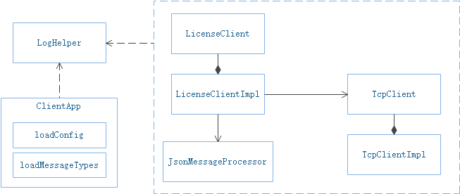
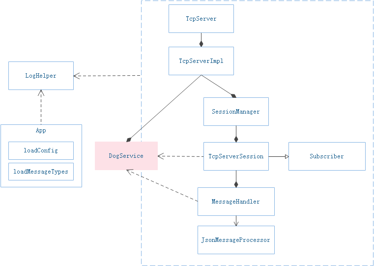
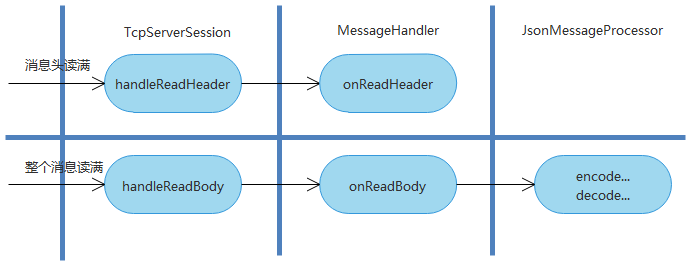
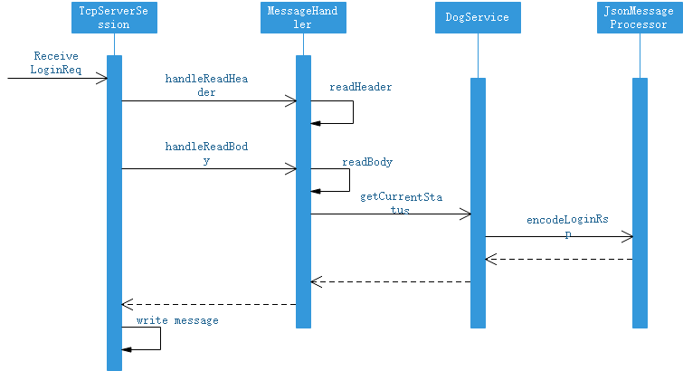
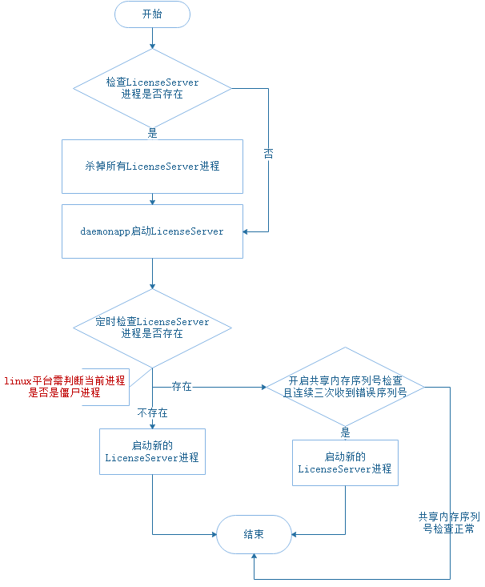

# license-server
基于boost.asio的tcp 局域网认证服务
## 0、工程结构

+ loghelper：简单的日志组件;
+ json_message_processor： json消息的encode和decode;
+ daemon: 守护进程；
+ conf: 工程和消息配置；
+ license-client：license客户端，以动态链接库的方式提供；
+ license-server：license服务端，内部集成看门狗服务（工程中看门狗相关代码已移除）

## 1、消息格式

消息格式为：

|        消息        |        长度(BYTES)        |        结构         |                             描述                             |
| :----------------: | :-----------------: | :----------------------------------------------------------: | :----------------------------------------------------------: |
| **Header** | 4 |    SyncBytes    | 格式：0x09, 0x6f, 0x01, 0x01，表示不同设备之间的交互 |
| **Header** | 4 | FullMessageLength |       数据总长度，包括SyncBytes和FullMessageLength        |
| **Header** | 4 |     MessageSeq     |                  消息序列 seq ，递增                  |
| **Header** | 4 |     MeaageType     |    消息类型（消息号)，如登录消息或发送消息消息    |
| **Header** | 4 |     StringBody     |                      消息字符流长度，可能是json流、xml流以及普通字符流                      |
| **Header** | 12 |      Reserved       |      保留字段，总共12字节     |
|  **Body**  |  StringBodyLength  |        StringBody   |                     消息体（ json或xml或普通字符串数据），该字段长度可能为0                     |
|  **Body**  |  FullMessageLength - 32 - StringBodyLength  |        BinaryData        |                  二进制数据，该字段长度可能为0                  |

注: 消息头总共**32**个字节（包括SyncBytes和FullMessageLength），消息体长度StringBodyLength是已知的，而二进制数据长度计算得到（FullMessageLength - 32 - StringBodyLength）。

## 2、license控制

+ license-server默认有个maxLicenseNum，即最大支持客户端个数；
+ 客户端认证一次，maxLicenseNum减1，直到maxLicenseNum ==0；
+ 客户端断开tcp连接或者停止服务，maxLicenseNum加1

## 3、网络库

+ license-server和 license-client底层均使用boost.asio的异步方式。

+ license-client已做隐藏，调用方可以不依赖于boost库。
+ 参考asio/example/cpp03/timeouts/server.cpp实现tcpserver
+ tcpclient实现参考path_to_boost/libs/asio/example/cpp03/chat/chat_client.cpp和path_to_boost/libs/asio/example/cpp03/timeouts/async_tcp_client.cpp

## 4、License-Client

+ C++客户端模块最终以动态链接库方式提供。

+ license-client提供给外部动态链接库，接口有：

  > ```cpp
  > 	// 开始认证服务
  > 	// cfg - 客户端的配置
  > 	// messageTypes - 消息映射表，必须和server保持一致
  > 	// cb - 看门狗状态的回调函数
  > 	void start(ClientConfig& cfg, MessageType_t& messageTypes, std::function<void(int)> cb);
  > 
  > 	// 停止认证服务
  > 	void stop();
  > 
  > 	void sendHeartbeatReq();
  > 	void sendLoginReq();
  > 	void sendLogoutReq();
  > 	void sendGetDogStatusReq();
  > ```


 

## 5、License-Server


### 各模块关系


如图为各模块关系，简要说明：

+ 为了减少对外暴露接口，使用PIMPL方式对外隐藏实现；

+ 每个tcpclient对应一个TcpServerSession对象，通过SessionManager集中管理；

+ 将具体业务转移到MessageHandler中处理，JsonMessageProcessor专门用于json消息的encode和decode；

+ main函数包含了程序配置加载和消息表映射读取，这部分也可以抽成单独模块。

### 消息触发  



如图在TcpClientImpl中async_read消息：

+ 当读到32字节消息头时，触发handlerReaderHeader，在消息预处理完成后，分发给注册的MessageHandler::onReadHeader处理；

+ 当读到完整的TcpMessage后，触发handleReadBoay，预处理完成后，分发给onReadBody处理。

### 消息处理流程  


如图，收到LoginReq消息后的处理流程：

+ 首先，读取消息头。检查消息头是否正确，如果正确继续往下执行；
+ 其次，读取消息体。在readBody中分发消息到具体处理函数，在onLoginReq中调用dogService.getCurrentStatus。
+ 最后，组装回复的LoginRsp消息，使用TcpServerSession的write发送消息。

## 6、心跳和保活

- 做了双向心跳，即客户端和服务端各自独立做心跳，目的是保证license能及时释放。
  - 客户端定时检查是否收到服务端的心跳回复(request)，如果连续3次没有收到心跳回复，则认为tcp连接断开；
  - 服务端定时检查是否收到客户端的心跳申请(respone)，如果连续3次没有收到心跳申请，则认为tcp连接断开；
  - **服务端和客户端的定时器间隔必须保持一致**

+ 客户端有连接断开重连机制，可以选择是否开启。

## 7、守护进程设计

几个限制条件：

+ 守护进程和工作进程必须在同一目录；
+ 只支持启动一个工作进程，只是定时检查pid是否存在
+ 启动时，首先检查本地是否存在同名进程，如有则先杀掉。
+ linux平台可能存在僵死进程情况，需要调用waitpid处理。
+ 工作流程示意图如下：

